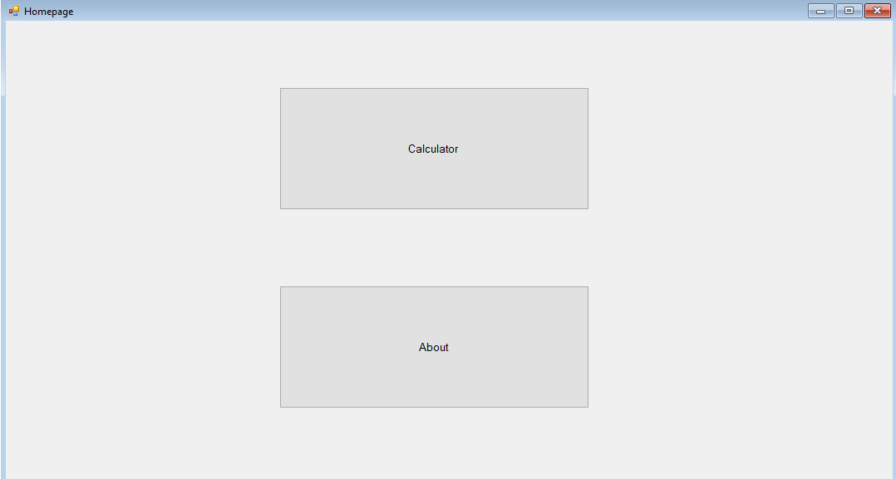
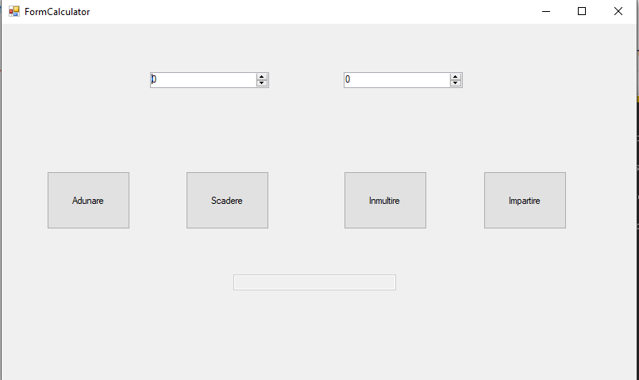
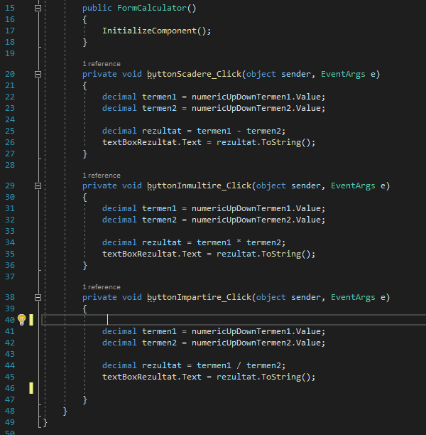
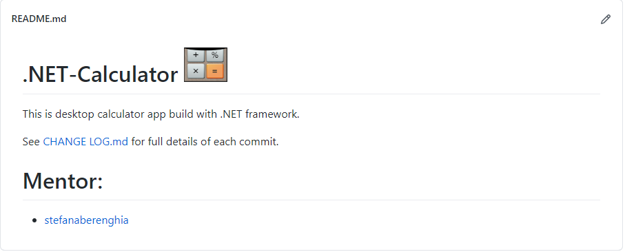

# Installed all pre-requisites 

- Visual Studio Community 2019, Microsoft SQL Server 2017 & Microsoft SQL Server Management Studio 18

# Week 1
- added the local repository setting files;

- created the GIT repository;

- created and renamed the first form. Added 2 buttons which were renamed to ButtonCalculatorForm and ButtonAboutForm. Looked at the size of the 1st button and modified the size to the 2nd one so that it is more visually pleasing;

- created a 2nd form which has a label (LabelAbout) which was linked to the About button. Added in the below text:

# Week 2

- change the Autosize property of the About lable is order to change the size;

- added the FormCalculator form (initially I added it as a class); 

- Added 2 NumericUpDown`s and 4 button for each calculator operation. Aligned and sized them to match;

- Linked the Calculator button to the FormCalculator. Also added IF statement on both buttons is case they are disposed from memory a new form will open;

- Added a TextBox that will show the result of each operation. Added the specific operation for each button in FormCalculator;

- Created a folder to host all the images and snippets that are going to be used in the CHANGE LOG.md file;

- created a CHANGE LOG.md file that is linked in the README.md file;

