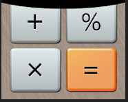

#  .NET-Calculator  

This is desktop calculator app build with .NET framework.

# Week 1

- added the repository settings files;

- created the GIT repository;

- created a main form with which the user will interact that has 2 buttons (Calculator & About);

- created another form which uses a label link with the About button that the can give more details regarding the applicaiton;

- created a 3rd form that will be eventually linked with the Calculator button.
