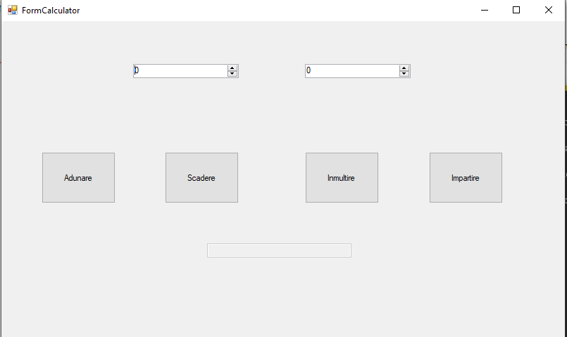

#  .NET-Calculator  

This is desktop calculator app build with .NET framework.

See [CHANGE LOG.md](https://github.com/CiobanuMarius/.NET-Calculator/blob/master/CHANGE%20LOG.md) for full details of each commit.

# Version 1.0

POC that all the operations are working as intended.

 # Mentor:

- [stefanaberenghia](https://github.com/stefanaberenghia)
